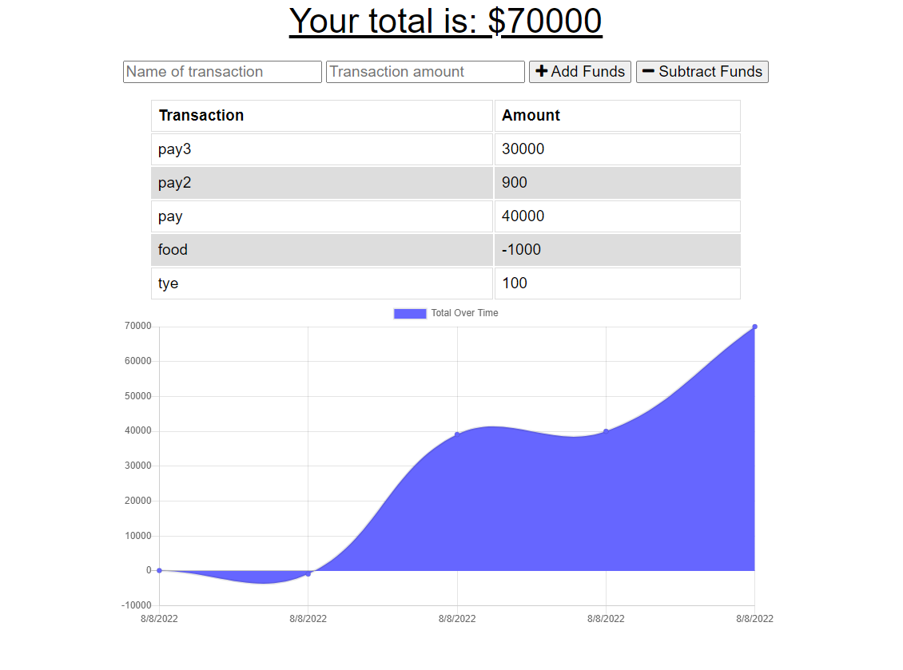

# PWA Budget Tracker

A Budget Tracker application that allows users to add expenses and deposits to their budget with or without a connection. When transactions are entered offline and then brought online, the total should already be filled in.

## Installation

1. Download/clone the repository
2. Do `npm install` to install the required npm packages

## Usage

* In the command prompt do the following command:
  `npm start`

* In your browser and go to
  `http://localhost:3001`

* By entering the following, user can add transactions as deposits or expenses:
  * Transaction Name
  * Transaction Amount
  * Add Funds for deposits
  * Subtract Funds for expenses

* Total is calculated instantly once you add or subtract funds

* This app can be used online and offline

* When coming back from being offline all of your entries will be sent

* PWA: you have the option to download this app for easy access

## Showcase
App Example:

## Links

* [Github Repo](https://github.com/TyeStanley/pwa-budget-tracker)
* [Deployed Heroku App](https://tye-budget-tracker.herokuapp.com/)

## Features

* JavaScript
* Node
* Express
* MongoDB
* Mongoose
* Progressive Web Application

## License

Copyright &copy; Tye Stanley. All rights reserved.
  
  Licensed under the [MIT](LICENSE) license.